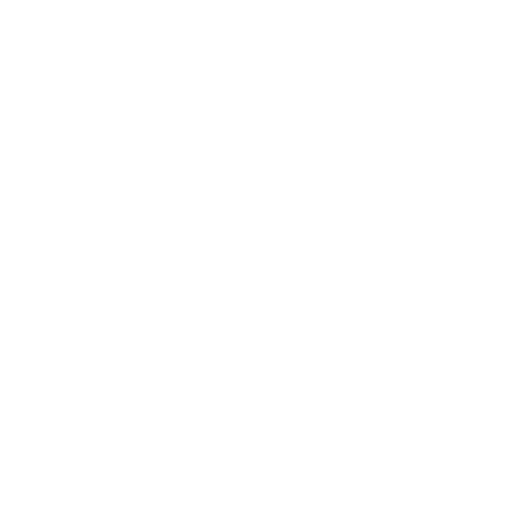

# Project Horizon


**Project Horizon** is a Unity-based multiplayer aerial combat game where players pilot jets to engage in thrilling dogfights over an infinite, procedurally generated terrain. The game combines the traditional Unity GameObject structure for map generation with ECS (Entity Component System) + DOTS (Data-Oriented Technology Stack) for optimized player input and multiplayer networking.

## Features

- **Infinite Terrain Generation:** Procedurally generated environments using GameObject-based systems inspired by traditional Unity workflows.
- **ECS + DOTS Optimization:** Smooth and efficient player movement and networking powered by Unity's ECS and DOTS.
- **Multiplayer Gameplay:** Host public or private games, or join a dedicated server for an engaging multiplayer experience.
- **Single-Player Mode:** Explore the terrain and practice your piloting skills in a private game.

## Learning Resources

This project was inspired and built upon ideas from the following creators:

- **Map Generation:** Check out Sebastian Lague's excellent tutorials on [Procedural Map Generation](https://www.youtube.com/watch?v=MRNFcywkUSA&list=PLFt_AvWsXl0eBW2EiBtl_sxmDtSgZBxB3&index=1).
- **ECS Player Input:** Learn ECS fundamentals and player input integration from Turbo Makes Games’ [ECS Tutorials](https://youtu.be/bFHvgqLUDbE?si=vnmw9A5UZ38EjFF2).

## Build Instructions

To build and run **Project Horizon**, follow these steps:

### Requirements

- **Unity Version:** Unity 6000.0.28f1 or newer (URP-compatible).
- **Development Environment:** Git, Visual Studio or Rider, and Unity Hub.

### Steps

1. **Clone the Repository:**
   ```bash
   git clone https://github.com/jbledua/Project-Horizon.git
   ```
2. **Open the Project in Unity:**
   - Launch Unity Hub.
   - Click `Add` and select the `Project-Horizon` folder.
3. **Set Build Target:**
   - Go to `File > Build Settings`.
   - Select your platform (Windows, macOS, Linux).
   - Click `Switch Platform`.
4. **Build the Game:**
   - For client builds, select `Client` scenes in Build Settings.
   - For server builds, select `Server` scenes and ensure the dedicated server script is active.
   - Click `Build` and save the executable in the desired directory.
5. **Run the Game:**
   - To host, start the server executable and share your public IP or Tailscale/VPN address.
   - Join as a player using the client executable and connect via IP or local network.


## Repositories

- **Main Project Repository:** [Project Horizon](https://github.com/jbledua/Project-Horizon) (This Repository)
- **Build Repository for Testing:** [Project Horizon Builds](https://github.com/jbledua/Project-Horizon-Build)

## License

This project is licensed under the MIT License. See the [LICENSE](LICENSE) file for details.

## Acknowledgments

Thanks to the Unity community and the creators of ECS and map generation tutorials for their incredible resources and inspiration.